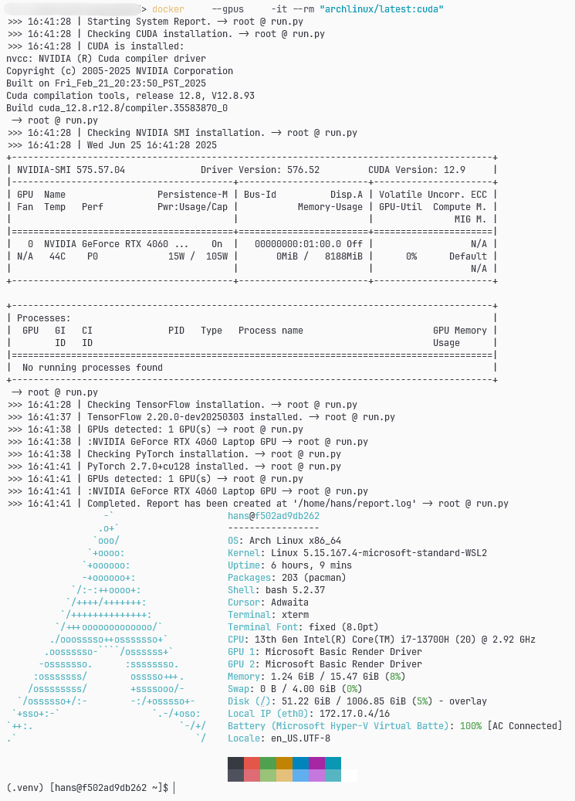

# Arch Linux Development Environment

This setup utilizes Docker containers to setup Arch Linux with CUDA drivers.

It also comes with the `uv` **package manager** with a virtual environment setup, configured with **popular deep learning frameworks** such as `PyTorch`, `TensorFlow` and other useful libraries, one of which is `OpenCV`.

## The `Dockerfile`

`Dockerfile` is created to store the building process of an image, gives the ability to customize if necessary in future developments.

This setup consists of 6 main steps:

1. **Setting Up the Build Arguments**
2. **Initialization of Arch Linux**
3. **Configuration of the User**
4. **Installation of Packages**
5. **Setting up CUDA & Drivers**
6. **Setting Up the Environment**

### 1. Setting Up the Build Arguments

The latest `archlinux` image is utilized as the base image:

```Dockerfile
# Arch Linux Development Environment
#   - Fastfetch (at the start of each bash session)
#   - Tensorflow & CUDA
#   - NVIDIA Drivers
#   - Python and C++ support
FROM archlinux:latest
```

> It can be pinned with its digest, which is exposed with:
>
> ```pwsh
> docker pull archlinux:latest
> docker images archlinux:latest --format '{{.Digest}}'
> ```

To simplify the rest of the building process, build arguments are created. This ensures a proper initialization of the environment while also making it configurable:

```Dockerfile
# ----------------------- BUILD ARGS ------------------------
# Set the user and group IDs for the container
#   This allows the container to run with the same user and group IDs as the host system
#   This is useful for avoiding permission issues when mounting volumes

ARG USER=hans
ARG GUID=1000
ARG UID=${GUID}
# Environment variables for the user
ENV HOME=/home/${USER}
ENV VENV_DIR=${HOME}/.base
# Development directory
ARG DEV=${HOME}/.dev/
```

### 2. Initialization of Arch Linux

First, the Arch Linux should be initialized with generating signature keys. System is updated and missing dependencies are installed:

> Locales are also generated in this step to be `en_US.UTF-8`.

```Dockerfile
# ------------------------ ARCH LINUX INIT & USER CONFIG ------------------------
# Initialize Arch Linux
#  This includes setting up the package manager, locale, and user permissions
# Set the user and group IDs for the container
#  This allows the container to run with the same user and group IDs as the host system

# -------------------------------- [  R O O T  ] --------------------------------
USER root

# Initialize Arch Linux
RUN pacman-key --init \
    && pacman -Sy --noconfirm sudo \
    && pacman-key --populate archlinux \
    && pacman --needed --noconfirm -Syu \
    # Generate en_US.UTF-8 locale
    && sed -i 's/#en_US.UTF-8/en_US.UTF-8/' /etc/locale.gen \
    && locale-gen \
    && pacman -Scc --noconfirm \
```

### 3. Configuration of the User

A new user is created, using the build arguments. The "home" directory is created and its permissions are configured:

> Created user is also set as a "sudoer".

```Dockerfile
    # Create a new user
    && useradd --create-home --shell /bin/bash ${USER} \
    && usermod -aG wheel ${USER} \
    # Setting the user as a "sudoer"
    && sed -i 's/^# %wheel/%wheel/' /etc/sudoers \
    && mkdir -p ${HOME}/.local \
    && mkdir -p ${HOME}/.cache \
    # Fix permissions for the home directory
    && chown -R ${USER}:${USER} ${HOME} \
```

### 4. Installation of Packages

CUDA, drivers and other related packages (e.g. fastfetch, openssh, git, curl etc.) are installed. For managing Python, `uv` package manager is installed:

```Dockerfile
    # ------------------------ INSTALLATION (Python & Packages) ------------------------
    # Install base development tools, essentials and CUDA
    #  This installs essential development tools such as Git, GCC, Make, and CMake
    && pacman -Sy --needed --noconfirm cmake gcc make fastfetch openssh unzip curl git vi nvim jq \
    && pacman -Sy --noconfirm nvidia cuda cudnn nccl \
    && pacman -S --noconfirm nvidia-container-toolkit opencl-nvidia \
    && pacman -Scc --noconfirm
```

### 5. Setting up CUDA & Drivers

To utilize GPU acceleration and parallel computation, **CUDA** must be set up and configured for deep learning frameworks such as TensorFlow, PyTorch etc.

```Dockerfile
# ------------------------ CUDA CONFIGURATION ------------------------
# Configure CUDA for the container
#  This includes setting up the CUDA toolkit and adding it to the PATH
    
# Add the CUDA folders to the PATH
#   Adds CUDA binaries and libraries to environment variables
ENV PATH=/opt/cuda/bin${PATH:+:${PATH}}
ENV LD_LIBRARY_PATH=/usr/lib:/opt/cuda/lib64
# Configure the Matplotlib temporary directory
ENV MPLCONFIGDIR=/tmp/matplotlib
```

> - `/opt/cuda/bin` is appended to the system `PATH` to ensure that **CUDA command-line tools** (like `nvcc`, `cuda-gdb`, etc.) are available from "anywhere" in the container.
> - `/opt/cuda/lib64` is appended to the system `LD_LIBRARY_PATH` to ensure that at runtime, the **dynamic linker** can find CUDA’s **shared libraries** (like `libcudart.so`, `libcublas.so`, etc.), which are required by deep learning frameworks (TensorFlow, PyTorch, etc.) and CUDA-accelerated applications.
> - Lastly, `/tmp/matplotlib` is set as `MPLCONFIGDIR` which is the Matplotlib `config`  directory to **prevent permission errors** when Matplotlib tries to write config or cache files.

#### 5.A What is CUDA?

**CUDA** (Compute Unified Device Architecture) is a **parallel computing platform** and programming model developed by NVIDIA.

- It allows developers to use NVIDIA GPUs for **general purpose processing (GPGPU)**, enabling significant acceleration for compute-intensive applications such as deep learning, scientific computing, and image processing.

#### 5.B What are cuDNN, cuFFT, and cuBLAS?

- **cuDNN**: NVIDIA **CUDA Deep Neural Network** library.
  - Provides **highly optimized implementations for standard routines** such as forward and backward convolution, pooling, normalization, and activation layers for deep neural networks.
- **cuFFT**: NVIDIA **CUDA Fast Fourier Transform** library.
  - Delivers **GPU-accelerated FFT computations** for signal and image processing.
- **cuBLAS**: NVIDIA **CUDA Basic Linear Algebra Subprograms** library.
  - Offers **GPU-accelerated linear algebra operations**, such as matrix multiplication and vector operations.

A detailed guide for setting up CUDA in Arch can be found at [[Arch Linux Wiki: GPGPU CUDA setup]](https://wiki.archlinux.org/title/GPGPU#CUDA)

### 6. Setting Up the Environment

Finally, the Python environment is set up and libraries including PyTorch, TensorFlow and OpenCV are installed. After the setup, the package data is stored as a `.lock` file for consistent builds in the future:

```Dockerfile
# ------------------------ ENVIRONMENT ------------------------
# Sets up the environment for the container
#  This includes setting a virtual environment, downlaoding packages, 
#  copying entrypoint scripts, and fixing permissions

# Set the locale to UTF-8
ENV LANG=en_US.UTF-8
ENV LANGUAGE=en_US.UTF-8

# Copy entrypoint bash script & change its' permission to executable
COPY entrypoint.sh /entrypoint.sh
RUN chmod +x /entrypoint.sh \
    # Create bin directory
    && mkdir -p ${HOME}/bin \
    && chown -R ${USER}:${USER} ${HOME}/bin
```

#### 6.1 Installing Oh My Posh

To improve the experience, popular prompt engine [[Oh My Posh]](https://ohmyposh.dev/) is installed and configured with a theme for the user. The theme file `theme.omp.json` is copied and engine is installed:

```Dockerfile
# Copy Oh-My-Posh theme
COPY theme.omp.json ${HOME}/bin/theme.omp.json
RUN chown ${USER}:${USER} ${HOME}/bin/theme.omp.json

# Copy project files to the home directory
COPY --chown=${USER}:${USER} . ${DEV}

# -------------------------------- [  U S E R  ] --------------------------------
USER ${USER}

# Installation & setup of Oh-My-Posh
RUN curl -s https://ohmyposh.dev/install.sh | bash -s -- -d ${HOME}/bin \
    && echo 'eval "$(oh-my-posh init bash --config $HOME/bin/theme.omp.json)"' >> ${HOME}/.bashrc
```

Then, `uv` virtual environment `.base` is initiated and packages are installed.

```Dockerfile
# Set the working directory to the project directory
WORKDIR ${DEV}

# Append ".local/bin" to PATH
#   This ensures that binaries installed by `uv` (such as Python) are available "system-wide"
ENV PATH="${HOME}/.local/bin:${HOME}/bin:${PATH}"

# Install the "uv" package manager, Python 3.12 and create a virtual environment
RUN curl -LsSf https://astral.sh/uv/install.sh | sh \
    && uv python install 3.12 \
    && uv venv --python 3.12 ${VENV_DIR} \
    && source ${VENV_DIR}/bin/activate \
    # Initialize a `uv` project (base)
    && uv init --bare --python 3.12 -v -n base \
    && uv pip install --upgrade pip \
    && uv pip install --no-cache-dir torch torchvision torchaudio --index-url https://download.pytorch.org/whl/cu130 \
    && uv pip install --no-cache-dir -r requirements.txt \
    # Save the installed packages to a lock file
    && uv pip compile requirements.txt -o uv.lock \
    # Clean uv cache
    && uv cache clean \
    # Fixing NCLL links
    && rm -rf ${VENV_DIR}/lib/python3.12/site-packages/torch/lib/../../nvidia/nccl \
    && ln -s /usr/lib/libnccl.so.2 ${VENV_DIR}/lib/python3.12/site-packages/torch/lib/libnccl.so.2
```

> An entrypoint script `entrypoint.sh` is provided and used at startup. This script includes environment activation and runs the report `.py` script.
>
> ```Dockerfile
> # Fetching System information
> RUN echo "fastfetch" >> /home/${USER}/.bashrc
>
> # Ensure the container starts in the user's HOME directory
> WORKDIR ${HOME}
>
> ENTRYPOINT ["/entrypoint.sh"]
> ```

## How to Use?

After pulling the image, it can be tested with:

```pwsh
docker run --gpus all -it --rm "archlinux/latest:cuda" bash
```

To **locally store** the image, remove `--rm` flag and specify a **name** for the container:

```pwsh
docker run --gpus all -it --name <NAME> "archlinux/latest:cuda" bash
```

### Configuring the Build Arguments

You can customize the Docker image by altering the build arguments defined in the `Dockerfile`. For example, you can change the default username, user ID, or group ID to fit your preferences or environment.

To specify custom values during the build process, use the `--build-arg` flag with `docker build`.

For example:

```pwsh
docker build --build-arg USER=<MY_USER_NAME> -D -t "archlinux/latest:cuda" .
```

This command sets the username to `MY_USER_NAME` in the resulting image.



### Creating a User Password

By default, the user account created in the container does **not** have a password set.  
If you need to use `sudo` or perform administrative tasks inside the container, you must set a password for your user after the container starts.

To set a password, open a new terminal and run:

```sh
docker exec -it <NAME> passwd <username>
```

Replace `<NAME>` with the name of your running container and `<username>` with your chosen username (default is `hans` unless changed via build arguments).

You will be prompted to enter and confirm a new password.  
After this, you can use `sudo` as expected inside the container.

> For security, do **not** set a password in the Dockerfile or image itself.  
> Always set it at runtime as shown above.

### Logging the Build Process

For curiosity and more verbose process, additional arguments can be provided to **log the process** to a `<BUILD_LOG.log>` file:

```pwsh
docker build --build-arg USER=hans -D --progress=plain -t "archlinux/latest:cuda" . *> <BUILD_LOG.log>
```

When this command is run, the build process is silent and instead logged to the `<BUILD_LOG.log>` file.

## Reminder to User

The whole process **takes quite a long time (over 30 min)** and the resulting image is **very large (>30 GB).** Currently thinking of an improvement on both areas.

<!--
## ToDos

- [x] Explain the  cuDNN, cuFFT and cuBLAS situation. Understand how it's related to the topic.
- [ ] Initialize `uv` to the `.dev/` directory as a project
  - Read more about projects [[here]](https://docs.astral.sh/uv/concepts/projects/)
- [ ] Find a better way to check system, done by `run.py`
  - Added `checkTorch` to `run.py`
- [ ] Properly set up OpenCV to connect the camera.

```bash
uv init --bare --python 3.12 --no-cache -v
```
-->